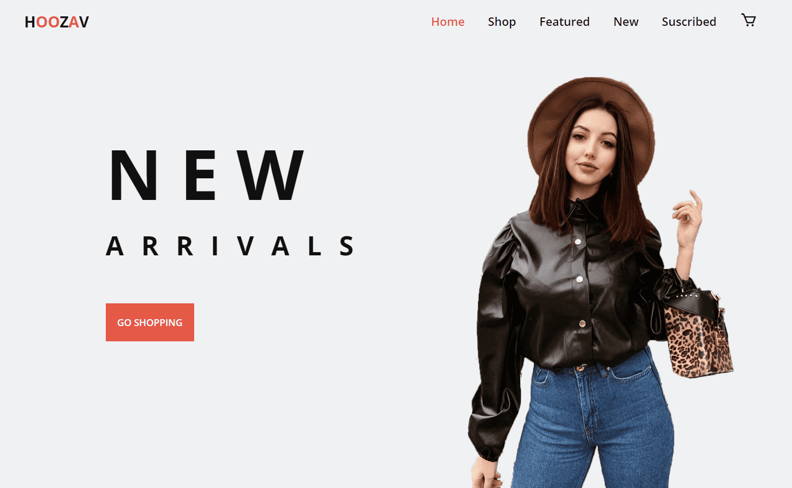

# <h1 align=center> **`E-commerce Project: LifeStyle Store`** </h1>

<p align="center">
    
    
</p>

Welcome to the GitHub repository for my modern e-commerce platform designed for selling accessories. Built with HTML, CSS, and vanilla JavaScript, this project provides an elegant and user-friendly shopping experience.

## Features Implemented

- **Modular Design**: Reusable components such as navigation menus, footer, and product cards.
- **Dynamic Product Rendering**: Products are dynamically loaded from a JSON file.
- **Filter Section**: A sidebar filter for refining product searches.
- **Product Filtering**: Allows filtering products by categories, price, and other attributes.
- **Newsletter Subscription**: Logic for capturing user email subscriptions.

## To-Do List

- **Cart Functionality**: Implement a feature to allow users to add products to a shopping cart.
- **Enhanced Filtering**: Expand and refine the filtering functionality.

## File Structure

```
a-github
│
│   index.html
│   shop.html
│   products.json
│
├───css
│       styles.css
│
├───img
│       (images for products and UI elements)
│
└───js
    │   main.js
    │
    ├───components
    │       footer.js
    │       header.js
    │       templates.js
    │
    └───modules
            cart.js
            menu.js
            newsletter.js
            products.js
```

## Main JavaScript File

The `main.js` file initializes the project by injecting reusable components and setting up the core functionality:

```javascript
import { createHeader } from './components/header.js';
import { createFooter } from './components/footer.js';
import { createProductCard } from './components/templates.js';
import { initMenu } from './modules/menu.js';
import { initCart } from './modules/cart.js';
import { initNewsletter } from './modules/newsletter.js';
import { initProducts } from './modules/products.js';

document.addEventListener('DOMContentLoaded', () => {
  const currentPage = document.body.classList.contains('shop-page') ? 'shop' : 'index';  

  // Insert header and footer
  document.getElementById('header').innerHTML = createHeader(currentPage);
  document.getElementById('footer').innerHTML = createFooter();

  // Initialize existing modules
  initMenu();
  initCart();
  initNewsletter();
  initProducts();
});
```

## Getting Started

### Prerequisites

- A modern web browser
- A local server setup (e.g., using VS Code's Live Server extension) to ensure proper loading of assets and JSON data.

### Installation

1. Clone this repository:
   ```bash
   git clone https://github.com/your-username/ecommerce-project.git
   ```
2. Open the project directory in Visual Studio Code:
   ```bash
   code ecommerce-project
   ```
3. Install the Live Server extension in VS Code.
4. Right-click on `index.html` in the file explorer and select **Open with Live Server**.
5. The project will automatically open in your default browser at `http://127.0.0.1:5500/` or a similar URL.

## Contributing

Contributions are welcome! Feel free to submit a pull request or create an issue for suggestions or bug fixes.

## License

This project is licensed under the MIT License. See the LICENSE file for details.


